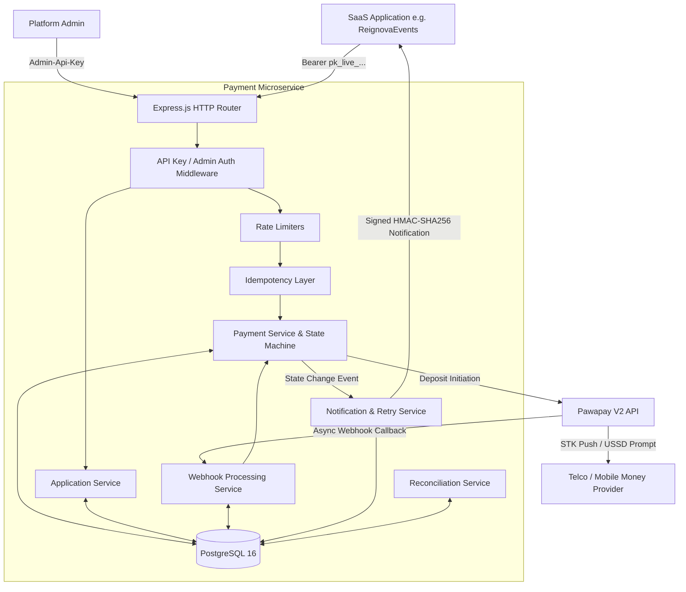

# Payment Service — Architecture Documentation

## 1. Overview

The Payment Service is a standalone, reusable payment orchestration microservice designed to serve multiple SaaS applications (e.g. ReignovaEvents). It encapsulates mobile-money deposit operations with **Pawapay**, providing SaaS applications with a clean REST API while managing tenant isolation, idempotency, webhook processing, signature verification, and asynchronous event notifications.

---

## 2. Core Architecture Diagram

---

## 3. Component Breakdown

### 3.1 HTTP Presentation & Routing Layer
- **Framework**: Express.js with TypeScript in NodeNext ESM.
- **Security Middleware**: Helmet, restricted CORS, per-tier rate limiters, request-id correlation.
- **Validation**: Zod runtime schema validation for all request bodies, parameters, and query parameters.
- **Documentation**: Swagger UI served dynamically at `/docs`.

### 3.2 Authentication & Multi-Tenancy Layer
- **Multi-Tenant Scoping**: Each SaaS application is registered as an `Application` entity with a unique `slug` and cryptographically generated `pk_live_` or `pk_test_` API key.
- **Key Storage**: Keys are hashed using SHA-256 with a system-wide pepper (`API_KEY_PEPPER`). Raw keys are never persisted.
- **Tenant Isolation**: All payment queries, idempotency keys, and notifications are scoped to `application_id`. One tenant cannot read, update, or infer the existence of another tenant's payments.

### 3.3 Payment Orchestration & State Machine
- **State Flow**:
  - Initial: `PENDING`
  - In Provider Flight: `PROCESSING`
  - Terminal: `COMPLETED`, `FAILED`, `CANCELLED`, `EXPIRED`
- **State Transition Guard**: Illegal transitions (such as skipping states or transitioning out of terminal states) are rejected by `isValidTransition()`.

### 3.4 Idempotency Subsystem
- **Mechanism**: Every payment creation request requires an `Idempotency-Key` header.
- **Canonical Hashing**: Request payloads are hashed using SHA-256 over normalized JSON keys.
- **Safety**: DB unique constraint on `(application_id, key)` prevents race conditions. In-flight requests lock the key, completed requests return cached responses, and payload mismatches return `409 CONFLICT`.

### 3.5 Integration Layer (Pawapay)
- **V2 API**: Implements Pawapay's V2 REST API (`/v2/deposits`, `/v2/predict-provider`, `/v2/deposits/{depositId}`).
- **Phone Number Normalization**: Accepts E.164 (`+255700000000`) and converts to MSISDN (`255700000000`).
- **Country Mapping**: Converts 2-letter ISO codes (`TZ`) to 3-letter ISO codes (`TZA`).
- **Signature Verification**: Supports RFC-9421 HTTP Message Signatures with public key caching.

### 3.6 Webhook & Notification Subsystem
- **Webhook Ingestion**: Fast 200 OK acknowledgement, duplicate event suppression via `(provider, event_key)` uniqueness.
- **Outgoing Notifications**: Delivers state change events to SaaS application's `webhook_url`.
- **Notification Signing**: Each notification is signed with HMAC-SHA256 (`X-Payment-Signature: t=<timestamp>,v1=<hmac>`) using the application's unique `webhook_secret`.
- **Reliable Delivery**: Database-backed exponential backoff retries (1m, 5m, 15m, 30m, 1h).
