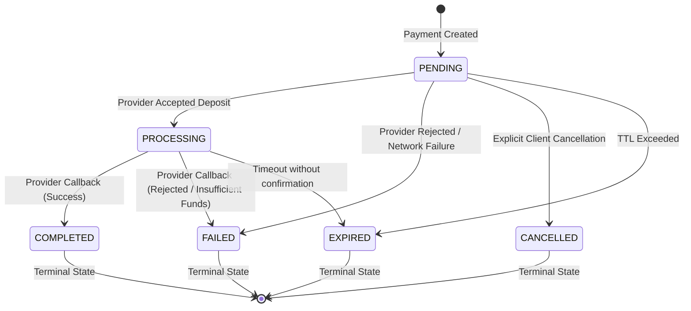

# Payment Lifecycle & State Machine

## 1. Lifecycle State Machine Diagram

---

## 2. Allowed Transitions Table

| From Status | To Status | Trigger |
| :--- | :--- | :--- |
| `PENDING` | `PROCESSING` | Pawapay responds with `ACCEPTED` or `DUPLICATE_IGNORED` |
| `PENDING` | `FAILED` | Pawapay immediately responds with `REJECTED` |
| `PENDING` | `CANCELLED` | Client cancels before provider submission |
| `PENDING` | `EXPIRED` | Payment window expired without submission |
| `PROCESSING` | `COMPLETED` | Pawapay webhook arrives with status `COMPLETED` |
| `PROCESSING` | `FAILED` | Pawapay webhook arrives with status `FAILED` |
| `PROCESSING` | `EXPIRED` | Reconciliation flags stale unconfirmed deposit |
| `COMPLETED` | *(none)* | **Terminal State** — no further transitions allowed |
| `FAILED` | *(none)* | **Terminal State** — no further transitions allowed |
| `CANCELLED` | *(none)* | **Terminal State** — no further transitions allowed |
| `EXPIRED` | *(none)* | **Terminal State** — no further transitions allowed |

---

## 3. Idempotency & Replays

1. **First Invocation**:
   - `Idempotency-Key` checked.
   - DB lock created with request SHA-256 hash.
   - Payment created in `PENDING` status.
   - Provider invoked; payment updated to `PROCESSING`.
   - Response cached in `idempotency_keys` table.
   - Returns `202 Accepted`.

2. **Subsequent Invocations (Identical Payload)**:
   - Same `(application_id, key)` found in database.
   - Checks hash match.
   - Returns cached response immediately with header `Idempotency-Replayed: true`.

3. **Subsequent Invocations (Altered Payload)**:
   - Hash mismatch detected.
   - Returns `409 Conflict` (`IDEMPOTENCY_CONFLICT`).

---

## 4. Asynchronous Notifications & Retries

When a payment transitions to `PROCESSING`, `COMPLETED`, or `FAILED`:
1. A `Notification` record is generated in `PENDING` status.
2. An asynchronous delivery attempt is dispatched immediately.
3. If delivery fails (network down or HTTP 5xx from client):
   - Status remains `PENDING`.
   - `attempt_count` increments.
   - `next_attempt_at` is scheduled using exponential backoff:
     - Attempt 1: 1 minute
     - Attempt 2: 5 minutes
     - Attempt 3: 15 minutes
     - Attempt 4: 30 minutes
     - Attempt 5: 1 hour
4. After 5 failed attempts, notification status changes to `FAILED`.
