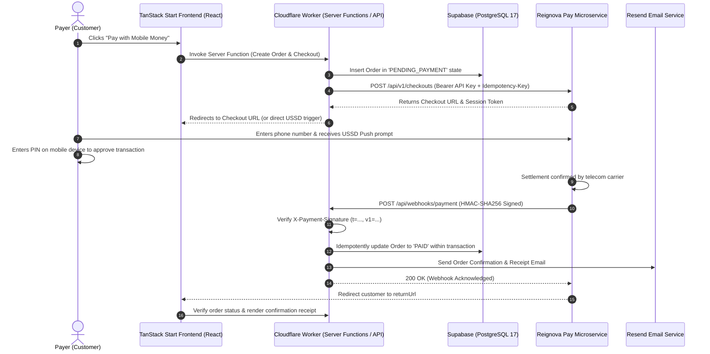

# Reignova Payment Service — Integration Guide

Comprehensive integration guide for integrating the **Reignova Payment Microservice** into a full-stack project built with:

- **Language / Runtime:** TypeScript (Strict)
- **Frontend & Fullstack Framework:** React with TanStack Start
- **Hosting / Compute:** Cloudflare Workers
- **Database:** PostgreSQL 17 on Supabase
- **Email Delivery:** Resend

---

## Table of Contents

1. [Architecture & System Flow](#1-architecture--system-flow)
2. [Merchant Credentials & Environment Setup](#2-merchant-credentials--environment-setup)
3. [Database Schema (PostgreSQL 17 on Supabase)](#3-database-schema-postgresql-17-on-supabase)
4. [Reignova Payment Service Client](#4-reignova-payment-service-client)
5. [Integration Flow Comparison](#5-integration-flow-comparison)
6. [Webhook Ingestion on Cloudflare Workers](#6-webhook-ingestion-on-cloudflare-workers)
7. [Email Delivery with Resend](#7-email-delivery-with-resend)
8. [TanStack Start Server Functions & UI](#8-tanstack-start-server-functions--ui)
9. [Request & Payload Reference](#9-request--payload-reference)
10. [Pre-Flight Verification Checklist](#10-pre-flight-verification-checklist)

---

## 1. Architecture & System Flow

The Reignova Payment Service operates as an isolated, multi-tenant payment orchestration engine. It abstracts mobile money operators in Tanzania (Vodacom M-Pesa (Future), Airtel Money, Tigo/Yas, and Halotel HaloPesa (Future) via Pawapay) and delivers status updates via signed webhook callbacks.



---

## 2. Merchant Credentials & Environment Setup

### 2.1 Register Your Application

To communicate with the Payment Microservice, register your application via the Payment Service Admin API:

```bash
curl -X POST https://pay-api.reignovatechnologies.com/api/v1/admin/applications \
  -H "Admin-Api-Key: <YOUR_ADMIN_API_KEY>" \
  -H "Content-Type: application/json" \
  -d '{
    "name": "My SaaS App",
    "slug": "my-saas-app",
    "description": "Production SaaS application",
    "webhookUrl": "https://myapp.com/api/webhooks/payment"
  }'
```

**Output response contains:**

- `apiKey`: `pk_live_...` (or `pk_test_...`) — **Store securely. Displayed once.**
- `webhookSecret`: `whsec_...` — **Used to verify incoming HMAC-SHA256 signatures.**

### 2.2 Cloudflare Workers Environment Variables

Configure your TanStack Start project running on Cloudflare Workers:

#### Local Development (`.dev.vars`)

````ini
PAYMENT_SERVICE_BASE_URL="http://pay-api.reignovatechnologies.com/api/v1"
PAYMENT_SERVICE_API_KEY="pk_test_your_secret_api_key"
PAYMENT_SERVICE_WEBHOOK_SECRET="whsec_your_webhook_secret"
APP_BASE_URL="http://localhost:3000"


#### Production Secrets (Cloudflare Wrangler)

```bash
npx wrangler secret put PAYMENT_SERVICE_API_KEY
npx wrangler secret put PAYMENT_SERVICE_WEBHOOK_SECRET
````

---

## 3. Database Schema (PostgreSQL 17 on Supabase)

Run the following migration in your Supabase SQL editor to support financial tracking and idempotent webhook processing:

```sql
-- 1. Order Status Enum
CREATE TYPE order_status AS ENUM (
  'PENDING_PAYMENT',
  'PROCESSING',
  'PAID',
  'FAILED',
  'CANCELLED',
  'REFUNDED'
);

-- 2. Orders Table
CREATE TABLE public.orders (
  id UUID PRIMARY KEY DEFAULT gen_random_uuid(),
  reference VARCHAR(100) NOT NULL UNIQUE,
  user_id UUID,
  customer_email VARCHAR(255) NOT NULL,
  customer_name VARCHAR(255),
  customer_phone VARCHAR(50),
  total_amount NUMERIC(18, 2) NOT NULL CHECK (total_amount > 0),
  currency VARCHAR(3) NOT NULL DEFAULT 'TZS',
  status order_status NOT NULL DEFAULT 'PENDING_PAYMENT',
  payment_id VARCHAR(100),
  checkout_url TEXT,
  metadata JSONB DEFAULT '{}'::jsonb,
  paid_at TIMESTAMPTZ,
  created_at TIMESTAMPTZ NOT NULL DEFAULT NOW(),
  updated_at TIMESTAMPTZ NOT NULL DEFAULT NOW()
);

CREATE INDEX idx_orders_reference ON public.orders (reference);
CREATE INDEX idx_orders_status ON public.orders (status);

-- 3. Webhook Deduplication Log (Ensures strict idempotent processing)
CREATE TABLE public.payment_webhook_logs (
  id UUID PRIMARY KEY DEFAULT gen_random_uuid(),
  event_id VARCHAR(255) NOT NULL UNIQUE,
  event_type VARCHAR(100) NOT NULL,
  reference VARCHAR(100) NOT NULL,
  payload JSONB NOT NULL,
  processed_at TIMESTAMPTZ NOT NULL DEFAULT NOW()
);

CREATE INDEX idx_webhook_logs_event_id ON public.payment_webhook_logs (event_id);
```

---

## 4. Reignova Payment Service Client

Create a reusable TypeScript client in `src/lib/payment-client.ts`:

```typescript
export interface CreateCheckoutRequest {
  reference: string;
  amount: number;
  currency: 'TZS';
  country: 'TZ';
  returnUrl: string;
  cancelUrl?: string;
  description?: string;
  customer?: {
    name?: string;
    email?: string;
    phoneNumber?: string;
  };
  metadata?: Record<string, unknown>;
  expiresAfter?: number; // In minutes (e.g. 15)
}

export interface CheckoutResponseData {
  id: string;
  reference: string;
  publicToken: string;
  checkoutUrl: string;
  status:
    'PENDING' | 'WAITING_PAYMENT' | 'PROCESSING' | 'COMPLETED' | 'FAILED' | 'EXPIRED' | 'CANCELLED';
  expiresAt?: string;
}

export interface ApiResponse<T> {
  success: boolean;
  data?: T;
  error?: {
    code: string;
    message: string;
    details?: unknown;
  };
}

export class PaymentServiceClient {
  private baseUrl: string;
  private apiKey: string;

  constructor(baseUrl: string, apiKey: string) {
    this.baseUrl = baseUrl.replace(/\/$/, '');
    this.apiKey = apiKey;
  }

  /**
   * Option A: Creates a hosted checkout session
   */
  async createCheckoutSession(
    payload: CreateCheckoutRequest,
    idempotencyKey?: string
  ): Promise<CheckoutResponseData> {
    const key = idempotencyKey || `chk-${payload.reference}-${Date.now()}`;

    const res = await fetch(`${this.baseUrl}/checkouts`, {
      method: 'POST',
      headers: {
        'Content-Type': 'application/json',
        Authorization: `Bearer ${this.apiKey}`,
        'Idempotency-Key': key
      },
      body: JSON.stringify(payload)
    });

    const body = (await res.json()) as ApiResponse<CheckoutResponseData>;

    if (!res.ok || !body.success || !body.data) {
      throw new Error(
        `Payment Service Error [${res.status}]: ${body.error?.message || 'Unknown error'}`
      );
    }

    return body.data;
  }

  /**
   * Option B: Direct USSD deposit prompt
   */
  async createDirectPayment(
    payload: {
      reference: string;
      amount: number;
      currency: 'TZS';
      phoneNumber: string; // E.164: +255XXXXXXXXX
      country: 'TZ';
      provider?: 'AIRTEL_TZA' | 'YAS_TZA' | 'TIGO_TZA';
      description?: string;
      metadata?: Record<string, unknown>;
    },
    idempotencyKey?: string
  ) {
    const key = idempotencyKey || `dep-${payload.reference}-${Date.now()}`;

    const res = await fetch(`${this.baseUrl}/payments`, {
      method: 'POST',
      headers: {
        'Content-Type': 'application/json',
        Authorization: `Bearer ${this.apiKey}`,
        'Idempotency-Key': key
      },
      body: JSON.stringify(payload)
    });

    const body = (await res.json()) as ApiResponse<any>;

    if (!res.ok || !body.success) {
      throw new Error(`Direct Payment Error: ${body.error?.message || res.statusText}`);
    }

    return body.data;
  }

  /**
   * Verification fallback endpoint
   */
  async getPaymentByReference(reference: string) {
    const res = await fetch(`${this.baseUrl}/payments/reference/${encodeURIComponent(reference)}`, {
      method: 'GET',
      headers: {
        Authorization: `Bearer ${this.apiKey}`
      }
    });

    const body = (await res.json()) as ApiResponse<any>;
    if (!res.ok || !body.success) {
      throw new Error(`Lookup failed: ${body.error?.message}`);
    }
    return body.data;
  }
}
```

---

## 5. Integration Flow Comparison

| Feature                | Option A: Hosted Checkout (`/checkouts`)                                                                | Option B: Direct Deposit (`/payments`)                                                    |
| :--------------------- | :------------------------------------------------------------------------------------------------------ | :---------------------------------------------------------------------------------------- |
| **User Experience**    | Customer redirected to branded hosted checkout UI (`pay.reignovatechnologies.com/checkout/cs_sec_...`). | User stays entirely on your TanStack Start app; your form initiates USSD prompt directly. |
| **Operator Selection** | Automated carrier detection and brand selector included.                                                | Frontend or backend must validate E.164 phone number (`+255...`).                         |
| **Security & PCI**     | Zero customer phone/card data touches your server.                                                      | Phone number is submitted through your application.                                       |
| **Best For**           | Web stores, event ticketing, self-serve portals.                                                        | Embedded modal checkout, customized single-page flows, mobile apps.                       |

---

## 6. Webhook Ingestion on Cloudflare Workers

The payment service sends HTTP POST callbacks with an HMAC-SHA256 signature in the `X-Payment-Signature` header.

### 6.1 Web Crypto Signature Verifier (`src/lib/payment-signature.ts`)

```typescript
export async function verifyWebhookSignature(
  rawBody: string,
  signatureHeader: string | null,
  secret: string,
  toleranceSeconds = 300
): Promise<boolean> {
  if (!signatureHeader || !rawBody || !secret) return false;

  const parts = signatureHeader.split(',');
  const tPart = parts.find((p) => p.startsWith('t='));
  const v1Part = parts.find((p) => p.startsWith('v1='));

  if (!tPart || !v1Part) return false;

  const timestampStr = tPart.substring(2);
  const signatureHex = v1Part.substring(3);
  const timestamp = parseInt(timestampStr, 10);

  if (isNaN(timestamp)) return false;

  // Anti-replay protection: 5-minute threshold
  const now = Math.floor(Date.now() / 1000);
  if (Math.abs(now - timestamp) > toleranceSeconds) {
    return false;
  }

  const payloadToSign = `${timestamp}.${rawBody}`;
  const encoder = new TextEncoder();

  const key = await crypto.subtle.importKey(
    'raw',
    encoder.encode(secret),
    { name: 'HMAC', hash: 'SHA-256' },
    false,
    ['sign']
  );

  const signatureBuffer = await crypto.subtle.sign('HMAC', key, encoder.encode(payloadToSign));

  const computedHex = Array.from(new Uint8Array(signatureBuffer))
    .map((b) => b.toString(16).padStart(2, '0'))
    .join('');

  // Constant-time comparison
  if (computedHex.length !== signatureHex.length) return false;
  let result = 0;
  for (let i = 0; i < computedHex.length; i++) {
    result |= computedHex.charCodeAt(i) ^ signatureHex.charCodeAt(i);
  }
  return result === 0;
}
```

### 6.2 TanStack Start API Route (`app/routes/api/webhooks/payment.ts`)

```typescript
import { verifyWebhookSignature } from '~/lib/payment-signature';
import { createClient } from '@supabase/supabase-js';
import { sendOrderConfirmationEmail } from '~/lib/email-service';

export async function POST({ request }: { request: Request }) {
  // CRITICAL: Read the raw body as text FIRST before parsing JSON
  const rawBody = await request.text();
  const signatureHeader = request.headers.get('x-payment-signature');
  const secret = process.env.PAYMENT_SERVICE_WEBHOOK_SECRET!;

  const isValid = await verifyWebhookSignature(rawBody, signatureHeader, secret);
  if (!isValid) {
    return new Response(JSON.stringify({ success: false, error: 'INVALID_SIGNATURE' }), {
      status: 401,
      headers: { 'Content-Type': 'application/json' }
    });
  }

  const webhook = JSON.parse(rawBody);
  const { event, timestamp, data } = webhook;

  const supabase = createClient(process.env.SUPABASE_URL!, process.env.SUPABASE_SERVICE_ROLE_KEY!);

  const eventKey = `${event}:${data.reference}:${data.paymentId || data.checkoutId || timestamp}`;

  // 1. Idempotency Check: suppress duplicates
  const { error: dedupError } = await supabase.from('payment_webhook_logs').insert({
    event_id: eventKey,
    event_type: event,
    reference: data.reference,
    payload: webhook
  });

  if (dedupError) {
    // Unique violation indicates duplicate delivery - acknowledge 200 OK safely
    return new Response(JSON.stringify({ success: true, duplicate: true }), { status: 200 });
  }

  // 2. Process Lifecycle Events
  if (event === 'payment.completed' || event === 'checkout.completed') {
    const { data: order, error } = await supabase
      .from('orders')
      .update({
        status: 'PAID',
        payment_id: data.paymentId || data.depositId,
        paid_at: data.completedAt || new Date().toISOString()
      })
      .eq('reference', data.reference)
      .select()
      .single();

    if (!error && order) {
      // 3. Dispatch receipt email asynchronously via Resend
      await sendOrderConfirmationEmail({
        to: order.customer_email,
        customerName: order.customer_name || 'Valued Customer',
        orderReference: order.reference,
        amount: order.total_amount,
        currency: order.currency
      });
    }
  } else if (event === 'payment.failed' || event === 'checkout.failed') {
    await supabase
      .from('orders')
      .update({
        status: 'FAILED',
        metadata: { failureReason: data.failureReason }
      })
      .eq('reference', data.reference);
  }

  return new Response(JSON.stringify({ success: true, processed: true }), {
    status: 200,
    headers: { 'Content-Type': 'application/json' }
  });
}
```

---

## 7. Email Delivery with Resend

Create `src/lib/email-service.ts`:

```typescript
import { Resend } from 'resend';

export async function sendOrderConfirmationEmail(params: {
  to: string;
  customerName: string;
  orderReference: string;
  amount: number;
  currency: string;
}) {
  const apiKey = process.env.RESEND_API_KEY;
  if (!apiKey) {
    console.warn('RESEND_API_KEY is not set. Skipping email delivery.');
    return;
  }

  const resend = new Resend(apiKey);
  const fromEmail = process.env.RESEND_FROM_EMAIL || 'receipts@notifications.yourdomain.com';

  const formattedAmount = new Intl.NumberFormat('en-US', {
    maximumFractionDigits: 0
  }).format(params.amount);

  await resend.emails.send({
    from: fromEmail,
    to: params.to,
    subject: `Payment Confirmed - Order #${params.orderReference}`,
    html: `
      <div style="font-family: sans-serif; max-width: 600px; margin: 0 auto; padding: 24px; color: #1e293b;">
        <h2 style="color: #0f172a;">Payment Received Successfully!</h2>
        <p>Hi ${params.customerName},</p>
        <p>Thank you for your payment. Your transaction has been verified.</p>
        
        <div style="background-color: #f8fafc; border: 1px solid #e2e8f0; border-radius: 8px; padding: 16px; margin: 20px 0;">
          <p style="margin: 4px 0;"><strong>Order Reference:</strong> ${params.orderReference}</p>
          <p style="margin: 4px 0;"><strong>Total Paid:</strong> ${params.currency} ${formattedAmount}</p>
          <p style="margin: 4px 0;"><strong>Status:</strong> <span style="color: #16a34a; font-weight: bold;">PAID</span></p>
        </div>

        <p>If you have any questions, simply reply to this email.</p>
        <hr style="border: none; border-top: 1px solid #e2e8f0; margin: 24px 0;" />
        <p style="font-size: 12px; color: #64748b;">Powered by Reignova Technologies</p>
      </div>
    `
  });
}
```

---

## 8. TanStack Start Server Functions & UI

### 8.1 Server Function to Initiate Checkout (`src/server/checkout.ts`)

```typescript
import { createServerFn } from '@tanstack/start';
import { PaymentServiceClient } from '~/lib/payment-client';
import { createClient } from '@supabase/supabase-js';

export const initiateCheckoutFn = createServerFn({ method: 'POST' })
  .validator(
    (d: {
      items: Array<{ title: string; price: number }>;
      customerName: string;
      customerEmail: string;
      customerPhone: string;
    }) => d
  )
  .handler(async ({ data }) => {
    const totalAmount = data.items.reduce((acc, item) => acc + item.price, 0);
    const reference = `ORD-${Date.now()}-${Math.floor(Math.random() * 1000)}`;

    const supabase = createClient(
      process.env.SUPABASE_URL!,
      process.env.SUPABASE_SERVICE_ROLE_KEY!
    );

    // 1. Create order record in PENDING_PAYMENT state
    const { error: dbError } = await supabase.from('orders').insert({
      reference,
      customer_name: data.customerName,
      customer_email: data.customerEmail,
      customer_phone: data.customerPhone,
      total_amount: totalAmount,
      currency: 'TZS',
      status: 'PENDING_PAYMENT'
    });

    if (dbError) throw new Error('Database order creation failed');

    // 2. Request hosted checkout from Payment Microservice
    const client = new PaymentServiceClient(
      process.env.PAYMENT_SERVICE_BASE_URL!,
      process.env.PAYMENT_SERVICE_API_KEY!
    );

    const appBaseUrl = process.env.APP_BASE_URL || 'http://localhost:3000';

    const session = await client.createCheckoutSession({
      reference,
      amount: totalAmount,
      currency: 'TZS',
      country: 'TZ',
      returnUrl: `${appBaseUrl}/checkout/success?reference=${reference}`,
      cancelUrl: `${appBaseUrl}/checkout/cancel?reference=${reference}`,
      description: `Purchase order #${reference}`,
      customer: {
        name: data.customerName,
        email: data.customerEmail,
        phoneNumber: data.customerPhone
      },
      metadata: {
        orderReference: reference
      }
    });

    // 3. Store checkout URL for recovery
    await supabase
      .from('orders')
      .update({ checkout_url: session.checkoutUrl })
      .eq('reference', reference);

    return {
      checkoutUrl: session.checkoutUrl,
      reference
    };
  });
```

### 8.2 Return & Fallback Verification Route (`app/routes/checkout/success.tsx`)

```tsx
import { createFileRoute } from '@tanstack/react-router';
import { createServerFn } from '@tanstack/start';
import { createClient } from '@supabase/supabase-js';
import { PaymentServiceClient } from '~/lib/payment-client';

const verifyPaymentFn = createServerFn({ method: 'GET' })
  .validator((reference: string) => reference)
  .handler(async ({ data: reference }) => {
    const supabase = createClient(
      process.env.SUPABASE_URL!,
      process.env.SUPABASE_SERVICE_ROLE_KEY!
    );

    const { data: order } = await supabase
      .from('orders')
      .select('*')
      .eq('reference', reference)
      .single();

    if (order && order.status === 'PAID') {
      return { status: 'PAID', order };
    }

    // Fallback polling: If webhook has not landed yet, check microservice directly
    const client = new PaymentServiceClient(
      process.env.PAYMENT_SERVICE_BASE_URL!,
      process.env.PAYMENT_SERVICE_API_KEY!
    );

    try {
      const paymentInfo = await client.getPaymentByReference(reference);
      if (paymentInfo.status === 'COMPLETED') {
        await supabase
          .from('orders')
          .update({ status: 'PAID', paid_at: new Date().toISOString() })
          .eq('reference', reference);

        return { status: 'PAID', order: { ...order, status: 'PAID' } };
      }
    } catch {
      // Still processing
    }

    return { status: order?.status || 'PROCESSING', order };
  });

export const Route = createFileRoute('/checkout/success')({
  loader: async ({ location }) => {
    const search = new URLSearchParams(location.search);
    const reference = search.get('reference') || '';
    return await verifyPaymentFn({ data: reference });
  },
  component: SuccessPage
});

function SuccessPage() {
  const { status, order } = Route.useLoaderData();

  return (
    <div className="max-w-md mx-auto my-16 p-8 border rounded-xl shadow-sm text-center">
      {status === 'PAID' ? (
        <>
          <div className="w-16 h-16 bg-green-100 text-green-600 rounded-full flex items-center justify-center mx-auto mb-4 text-2xl font-bold">
            ✓
          </div>
          <h1 className="text-2xl font-bold">Payment Confirmed!</h1>
          <p className="text-gray-600 mt-2">
            Order Reference: <strong>{order?.reference}</strong>
          </p>
          <p className="text-gray-500 text-sm mt-4">
            A receipt has been dispatched to {order?.customer_email}.
          </p>
        </>
      ) : (
        <>
          <div className="animate-spin w-12 h-12 border-4 border-amber-500 border-t-transparent rounded-full mx-auto mb-4" />
          <h1 className="text-xl font-bold">Verifying Payment...</h1>
          <p className="text-gray-500 mt-2">
            Please approve the prompt on your phone if you haven't already.
          </p>
        </>
      )}
    </div>
  );
}
```

---

## 9. Request & Payload Reference

### Validation Rules

- **Currency:** Must be `TZS`.
- **Amount:** Positive integer without decimals (e.g. `50000`, not `50000.00`). Max `100,000,000`.
- **Phone Numbers:** E.164 format: `^\+255\d{9}$` (e.g., `+255754123456`).

### Supported Providers (Tanzania)

| Operator         | Provider Code          | Test Sandbox Range                 |
| :--------------- | :--------------------- | :--------------------------------- |
| **Airtel Money** | `AIRTEL_TZA`           | `+255780000000` to `+255789999999` |
| **Tigo / Yas**   | `YAS_TZA` / `TIGO_TZA` | `+255710000000` to `+255719999999` |

### Required Headers Matrix

| Endpoint                          | Method            | `Authorization`      | `Idempotency-Key` | `Content-Type`                   |
| :-------------------------------- | :---------------- | :------------------- | :---------------- | :------------------------------- |
| `/api/v1/checkouts`               | `POST`            | `Bearer pk_live_...` | **Required**      | `application/json`               |
| `/api/v1/payments`                | `POST`            | `Bearer pk_live_...` | **Required**      | `application/json`               |
| `/api/v1/payments/:id`            | `GET`             | `Bearer pk_live_...` | Optional          | N/A                              |
| `/api/v1/payments/reference/:ref` | `GET`             | `Bearer pk_live_...` | Optional          | N/A                              |
| `/api/webhooks/payment`           | `POST` (Incoming) | N/A                  | N/A               | `X-Payment-Signature` (Required) |

---

## 10. Pre-Flight Verification Checklist

- [ ] **Preserve Raw Body:** Verified that Cloudflare Worker reads `await request.text()` before `JSON.parse` to avoid signature verification mismatch.
- [ ] **Timing-Safe Comparison:** Used constant-time bitwise comparison to protect against timing attacks on HMAC signatures.
- [ ] **Anti-Replay Window:** Enforced 5-minute timestamp tolerance check on `X-Payment-Signature`.
- [ ] **Database Idempotency:** Implemented `payment_webhook_logs` deduplication in Supabase to absorb duplicate webhook deliveries cleanly.
- [ ] **Local End-to-End Simulation:** Tested with local tunnel (`ngrok http 3000`) and verified USSD push test numbers (`+255754000000`) successfully transition orders to `PAID` and fire Resend emails.
